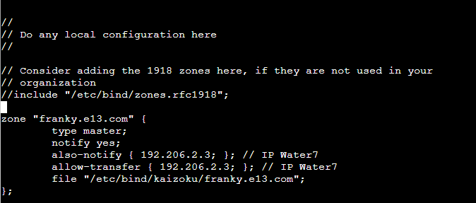

# Jarkom-Modul-2-E13-2021
Kelompok E13
|NRP           |Nama                   |
|:------------:|:---------------------:|
|05111940000090|Ihsannur Rahman Qalbi|
|05111940000003|Fairuz Hasna Rofifah|
|05111940000164|Ahmad Aunul Ma`bud|

## Soal 1
EniesLobby akan dijadikan sebagai DNS Master, Water7 akan dijadikan DNS Slave, dan Skypie akan digunakan sebagai Web Server. Terdapat 2 Client yaitu Loguetown, dan Alabasta. Semua node terhubung pada router Foosha, sehingga dapat mengakses internet.
### Jawaban
Membuat topologi seperti pada gambar, kemudian setting network masing-masing node.


Jalankan `iptables -t nat -A POSTROUTING -o eth0 -j MASQUERADE -s 192.206.0.0/16` pada router Foosha.

Jalankan `echo nameserver 192.168.122.1 > /etc/resolv.conf` pada node ubuntu yang lain, contohnya Loguetown.

Restart semua node dan coba ping google.com. Berikut bukti Loguetown dapat mengakses internet.


## Soal 2
Luffy ingin menghubungi Franky yang berada di EniesLobby dengan denden mushi. Kalian diminta Luffy untuk membuat website utama dengan mengakses franky.yyy.com dengan alias www.franky.yyy.com pada folder kaizoku.

### Jawaban
**Pada EneisLobby**
* Edit `/etc/bind/named.conf.local` tambahkan:

* Buat direktori baru bernama `kaizoku`
  ```bash
  mkdir /etc/bind/kaizoku
  ````
* Copy `db.local` ke dalam direktori `kaizoku` dan ubah namanya menjadi `franky.e13.com`
  ```bash
  cp /etc/bind/db.local /etc/bind/kaizoku/franky.e13.com
  ```
* Edit `/etc/bind/kaizoku/franky.e13.com`, tambahkan konfigurasi seperti dibawah ini:
  
* Lalu restart bind9
  ```bash
  service bind9 restart
  ```
**Pada Loguetown**
* Edit `/etc/resolv.conf` dengan memasukkan IP EniesLobby sebagai nameserver:
  
* Kemudan lakukan test dengan
  ```bash
  ping franky.e13.com
  ping www.franky.e13.com
  ```
  
  
## Soal 3
Setelah itu buat subdomain super.franky.yyy.com dengan alias www.super.franky.yyy.com yang diatur DNS nya di EniesLobby dan mengarah ke Skypie
### Jawaban
**Pada EniesLobby**
* Edit `etc/bind/kaizoku/franky.e13.com` seperti gambar dibawah untuk menambahkan alias `www.super` dan subdomain `super`
  
* Lalu restart bind9
  ```bash
  service bind9 restart
  ```
**Pada Loguetown**
* Kemudian lakukan test degnan `ping super.franky.e13.com` dan `ping www.super.franky.e13.com`
  
  
## Soal 4
Buat juga reverse domain untuk domain utama
### Jawaban
**Pada EniesLobby**
* Edit `/etc/bind/named.conf.local` seperti dibawah ini
  
* Copy `db.local` ke direktory `kaizoku` dan diraname menjadi `2.206.192.in-addr.arpa`
  
  ```bash
  cp /etc/bind/db.local /etc/bind/kaizoku/2.206.192.in-addr.arpa
  ```
* Edit `/etc/bind/kaizoku/2.206.192.in-addr.arpa` seperti dibawah ini
  
## Soal 5
Supaya tetap bisa menghubungi Franky jika server EniesLobby rusak, maka buat Water7 sebagai DNS Slave untuk domain utama.

### Jawaban
**Pada EnisLobby**

- Edit **/etc/bind/named.conf.local**, menjadi seperti berikut:
  
- Lalu restart bind9
  
`service bind9 restart`
- Kemudian stop bind9

 `service bind9 stop`

**Pada Water7**
- Edit **/etc/bind/named.conf.local**
  

- Lalu restart bind9
  
**Pada Loguetown**
- Edit **/etc/resolv.conf**, tambahkan IP Water7 sebagai nameserver


- Lalu coba test dengan:
  
`ping franky.e13.com`


## Soal 6
Setelah itu terdapat subdomain mecha.franky.yyy.com dengan alias www.mecha.franky.yyy.com yang didelegasikan dari EniesLobby ke Water7 dengan IP menuju ke Skypie dalam folder sunnygo

### Jawaban
**Pada EniesLobby**
- Edit **/etc/bind/kaizoku/franky.e13.com**, tambahkan:


- Edit **/etc/bind/named.conf.options**, comment dan tambahkan:


- Edit **/etc/bind/named.conf.local**, tambahkan:


- Lalu restart bind9
  
`service bind9 restart`

**Pada Water7**
- Edit /etc/bind/named.conf.options, comment dan tambahkan:


- Buat direktori baru bernama sunnygo

`mkdir /etc/bind/sunnygo`
- Copy db.local ke direktori sunnygo, dan ubah namanya menjadi mecha.franky.e13.com

`cp /etc/bind/db.local /etc/bind/sunnygo/mecha.franky.e13.com`

- Edit **/etc/bind/sunnygo/mecha.franky.e13.com**, menjadi:


- Lalu restart bind9
  
`service bind9 restart`

**Pada Loguetown**
- Lakukan dilakukan test sebagai berikut:

`ping mecha.franky.e13.com`

`ping www.mecha.franky.e13.com`


## Soal 7
Untuk memperlancar komunikasi Luffy dan rekannya, dibuatkan subdomain melalui Water7 dengan nama general.mecha.franky.yyy.com dengan alias www.general.mecha.franky.yyy.com yang mengarah ke Skypie

### Jawaban
**Pada Water7**
- Edit /etc/bind/sunnygo/mecha.franky.e13.com, tambahkan:
  


- Lalu restart bind9

`service bind9 restart`

**Pada Loguetown**
- Lakukan test dengan cara:

`ping general.mecha.franky.e13.com`


`ping www.general.mecha.franky.e13.com`


atau

`host -t A general.mecha.franky.e13.com`


`host -t A www.general.mecha.franky.e13.com`


- 
## Soal 8
Setelah melakukan konfigurasi server, maka dilakukan konfigurasi Webserver. Pertama dengan webserver www.franky.yyy.com. Pertama, luffy membutuhkan webserver dengan DocumentRoot pada /var/www/franky.yyy.com.

### Jawaban

## Soal 9
Setelah itu, Luffy juga membutuhkan agar url www.franky.yyy.com/index.php/home dapat menjadi menjadi www.franky.yyy.com/home. 
### Jawaban

## Soal 10
Setelah itu, pada subdomain www.super.franky.yyy.com, Luffy membutuhkan penyimpanan aset yang memiliki DocumentRoot pada /var/www/super.franky.yyy.com .

### Jawaban

## Soal 11
Akan tetapi, pada folder /public, Luffy ingin hanya dapat melakukan directory listing saja.
### Jawaban

## Soal 12
Tidak hanya itu, Luffy juga menyiapkan error file 404.html pada folder /error untuk mengganti error kode pada apache .
### Jawaban

## Soal 13
Luffy juga meminta Nami untuk dibuatkan konfigurasi virtual host. Virtual host ini bertujuan untuk dapat mengakses file asset www.super.franky.yyy.com/public/js menjadi www.super.franky.yyy.com/js.

### Jawaban

## Soal 14
Dan Luffy meminta untuk web www.general.mecha.franky.yyy.com hanya bisa diakses dengan port 15000 dan port 15500
### Jawaban

## Soal 15
dengan autentikasi username luffy dan password onepiece dan file di /var/www/general.mecha.franky.yyy
### Jawaban

## Soal 16
Dan setiap kali mengakses IP Skypie akan dialihkan secara otomatis ke www.franky.yyy.com

### Jawaban

## Soal 17
Dikarenakan Franky juga ingin mengajak temannya untuk dapat menghubunginya melalui website www.super.franky.yyy.com, dan dikarenakan pengunjung web server pasti akan bingung dengan randomnya images yang ada, maka Franky juga meminta untuk mengganti request gambar yang memiliki substring “franky” akan diarahkan menuju franky.png. Maka bantulah Luffy untuk membuat konfigurasi dns dan web server ini!

### Jawaban

## Kendala
1. Mengalami kesulitan untuk memberikan alias pada subdomain di soal 3 dan 7.
2. Kurang teliti saat melakukan config.
## Pembagian Tugas

|Nama           |Soal                   |
|:------------:|:---------------------:|
|Ihsannur Rahman Qalbi|1-2|
|Fairuz Hasna Rofifah|3-4|
|Ahmad Aunul Ma`bud|5-7|